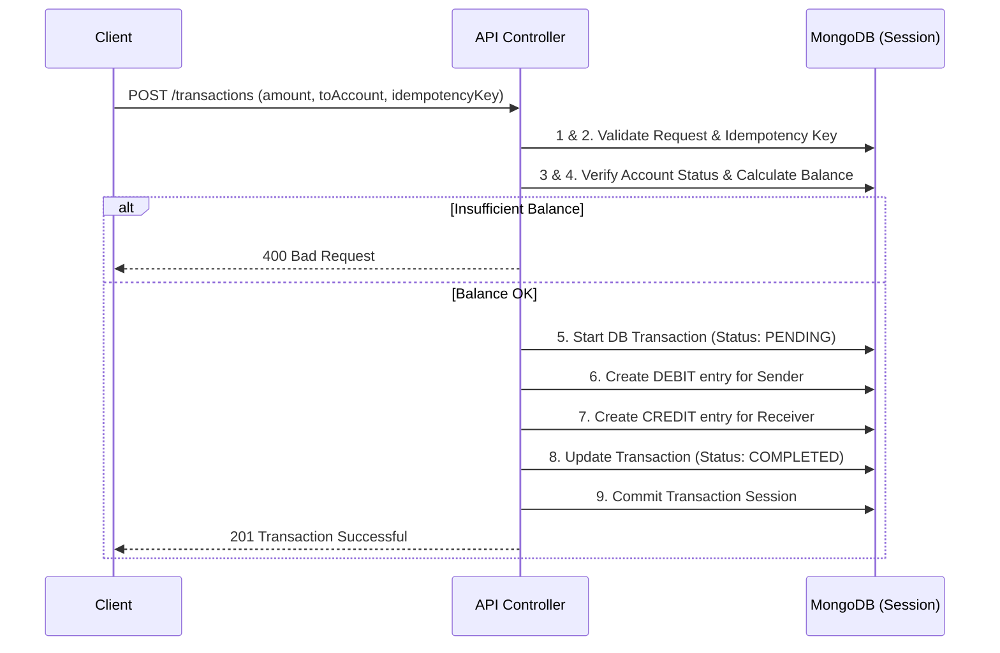

# 🏦 Advanced Payment Ledger System


A robust, production-ready backend payment processing system designed to handle secure financial transactions. This project demonstrates core backend engineering principles including **ACID-compliant database transactions**, **idempotency**, and **double-entry ledger accounting**.

## 🚀 Key Architectural Highlights

Recruiters and engineers evaluating this project should note the following advanced backend patterns implemented:

- **Idempotency Keys**: Prevents double-spending and duplicate transactions if a network request is retried or interrupted.
- **ACID Database Transactions**: Uses MongoDB Sessions to execute a 10-step atomic transfer flow. If any step (like debiting or crediting) fails, the entire transaction rolls back automatically.
- **Double-Entry Ledger**: Balances are not stored as static numbers. Instead, they are dynamically derived from a strict, immutable history of `CREDIT` and `DEBIT` ledger entries.
- **Stateless Authentication**: JWT-based auth with robust security (token blacklisting on logout).

---

## 🏗️ System Architecture: Transaction Flow

When a user initiates a transfer, the system processes it through a strict 10-step atomic pipeline:



---

## 💻 Tech Stack
- **Runtime Environment:** Node.js
- **Framework:** Express.js
- **Database:** MongoDB (Mongoose ODM)
- **Security:** bcryptjs (password hashing), jsonwebtoken (JWT auth)
- **Notifications:** Nodemailer (Transaction alerts)

---

## ⚙️ Local Setup & Installation

1. **Clone and Install:**
   ```bash
   git clone <your-repo-url>
   cd Payment-Ledger-System
   npm install
   ```

2. **Environment Configuration (`.env`):**
   Create a `.env` file in the root directory:
   ```env
   PORT=3000
   MONGO_URI=mongodb://127.0.0.1:27017/backend-ledger
   JWT_SECRET=your_super_secret_key
   EMAIL_USER=your_email@gmail.com
   CLIENT_ID=your_oauth_client_id
   CLIENT_SECRET=your_oauth_client_secret
   REFRESH_TOKEN=your_oauth_refresh_token
   ```

3. **Run the Server:**
   ```bash
   npm run dev
   ```

---

## 📡 Core API Reference

### Auth
- `POST /api/auth/register` - Create a new user
- `POST /api/auth/login` - Authenticate & receive JWT
- `POST /api/auth/logout` - Invalidate active JWT (Blacklisting)

### Accounts
- `POST /api/accounts/` - Provision a new financial account
- `GET /api/accounts/` - Retrieve all accounts for the authorized user
- `GET /api/accounts/balance/:accountId` - Calculate real-time balance from ledger

### Transactions
- `POST /api/transactions/` - Execute an idempotency-protected money transfer
- `POST /api/transactions/system/initial-funds` - System bypass for funding (Admin only)
